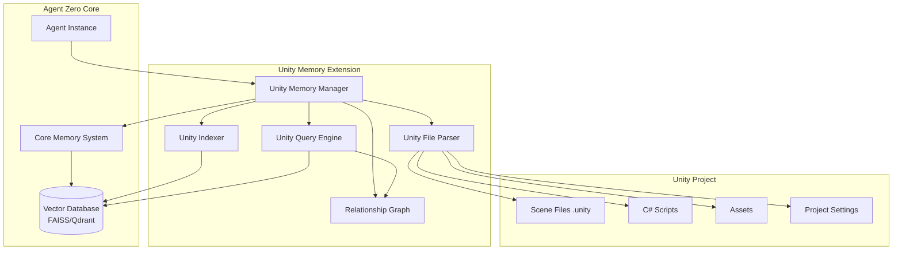

# Design Document

## Overview

The Unity Game Development Memory System extends Agent Zero's existing memory infrastructure to provide specialized storage, retrieval, and management capabilities for Unity game development projects. The system leverages Agent Zero's vector database backend (FAISS or Qdrant) while introducing Unity-specific memory areas, parsers, and retrieval strategies.

The design follows a layered architecture where Unity-specific components sit atop Agent Zero's core memory system, ensuring seamless integration while providing specialized functionality. The system automatically extracts and indexes Unity project information, maintains relationship graphs between project entities, and provides intelligent context-aware retrieval for development tasks.

## Architecture

### High-Level Architecture



### Memory Area Structure

The system creates specialized memory subdirectories within Agent Zero's existing memory structure:

```
memory/
├── projects/
│   └── {unity_project_name}/
│       ├── unity_scenes/          # Scene hierarchies and configurations
│       ├── unity_scripts/         # Script definitions and metadata
│       ├── unity_assets/          # Asset metadata and references
│       ├── unity_relationships/   # Entity relationship graph
│       ├── unity_decisions/       # Development decisions and solutions
│       ├── unity_tasks/           # Task tracking and status
│       ├── unity_tests/           # Test scenarios and results
│       └── unity_best_practices/  # Unity patterns and guidelines
```

### Data Flow

1. **Indexing Flow**: Unity files → Parser → Structured Data → Indexer → Vector Embeddings → Vector Database
2. **Query Flow**: User Query → Query Engine → Vector Search + Graph Traversal → Ranked Results → Agent Context
3. **Update Flow**: File Change Event → Parser → Diff Calculation → Indexer → Database Update → Relationship Graph Update

## Components and Interfaces

### 1. Unity Memory Manager

**Purpose**: Orchestrates all Unity-specific memory operations and serves as the main interface for agents.

**Interface**:
```python
class UnityMemoryManager:
    def __init__(self, agent_context: AgentContext, project_path: str):
        """Initialize Unity memory manager for a specific project."""
        
    async def initialize_project(self) -> bool:
        """Create memory areas and index existing Unity project files."""
        
    async def update_from_file_change(self, file_path: str) -> bool:
        """Update memory when a Unity file is modified."""
        
    async def query_scenes(self, query: str, filters: dict = None) -> List[MemoryResult]:
        """Search for scene-related information."""
        
    async def query_scripts(self, query: str, filters: dict = None) -> List[MemoryResult]:
        """Search for script-related information."""
        
    async def query_assets(self, query: str, filters: dict = None) -> List[MemoryResult]:
        
    async def get_relationships(self, entity_id: str, relationship_type: str = None) -> RelationshipGraph:
        """Retrieve relationship graph for an entity."""
        
    async def store_decision(self, problem: str, solution: str, context: dict) -> str:
        """Store a development decision with context."""
        
    async def store_task(self, task: Task) -> str:
        """Store a development task."""
        
    async def update_task_status(self, task_id: str, status: str, details: dict = None) -> bool:
        """Update task status and details."""
        
    async def store_test_result(self, test: TestScenario) -> str:
        """Store test scenario and results."""
```

### 2. Unity File Parser

**Purpose**: Extracts structured information from Unity project files.

**Interface**:
```python
class UnityFileParser:
    def parse_scene(self, scene_path: str) -> SceneData:
        """Parse Unity scene file and extract GameObject hierarchy."""
        
    def parse_script(self, script_path: str) -> ScriptData:
        """Parse C# script and extract classes, methods, Unity attributes."""
        
    def parse_asset_meta(self, asset_path: str) -> AssetData:
        """Parse asset metadata file."""
        
    def parse_project_settings(self, settings_path: str) -> ProjectSettings:
        """Parse Unity project settings."""
```

**SceneData Structure**:
```python
@dataclass
class SceneData:
    scene_name: str
    scene_path: str
    game_objects: List[GameObjectData]
    root_objects: List[str]
    
@dataclass
class GameObjectData:
    name: str
    tag: str
    layer: int
    components: List[ComponentData]
    children: List[str]
    parent: Optional[str]
    
@dataclass
class ComponentData:
    type: str
    properties: dict
    script_reference: Optional[str]
```

**ScriptData Structure**:
```python
@dataclass
class ScriptData:
    file_path: str
    namespace: Optional[str]
    classes: List[ClassData]
    imports: List[str]
    
@dataclass
class ClassData:
    name: str
    base_classes: List[str]
    attributes: List[str]  # Unity attributes like [SerializeField]
    methods: List[MethodData]
    fields: List[FieldData]
    
@dataclass
class MethodData:
    name: str
    parameters: List[tuple]  # (name, type)
    return_type: str
    is_unity_callback: bool  # Start, Update, OnCollisionEnter, etc.
```

### 3. Unity Indexer

**Purpose**: Converts parsed Unity data into vector embeddings and stores them in the memory system.

**Interface**:
```python
class UnityIndexer:
    def __init__(self, memory_manager: UnityMemoryManager):
        """Initialize indexer with memory manager."""
        
    async def index_scene(self, scene_data: SceneData) -> List[str]:
        """Index scene data and return memory IDs."""
        
    async def index_script(self, script_data: ScriptData) -> List[str]:
        """Index script data and return memory IDs."""
        
    async def index_asset(self, asset_data: AssetData) -> str:
        """Index asset metadata and return memory ID."""
        
    async def update_index(self, entity_id: str, updated_data: dict) -> bool:
        """Update existing index entry."""
        
    async def remove_from_index(self, entity_id: str) -> bool:
        """Remove entity from index."""
```

**Indexing Strategy**:
- **Scenes**: Each GameObject indexed separately with full hierarchy path for context
- **Scripts**: Classes and methods indexed separately with namespace and file context
- **Assets**: Indexed with type, usage context, and metadata
- **Relationships**: Stored in both vector DB (for semantic search) and graph structure (for traversal)

### 4. Relationship Graph

**Purpose**: Maintains a graph structure of relationships between Unity entities for efficient traversal.

**Interface**:
```python
class RelationshipGraph:
    def add_relationship(self, source_id: str, target_id: str, 
                        relationship_type: str, metadata: dict = None):
        """Add a relationship between two entities."""
        
    def get_relationships(self, entity_id: str, 
                         relationship_type: str = None) -> List[Relationship]:
        """Get all relationships for an entity."""
        
    def get_dependency_chain(self, entity_id: str, max_depth: int = 5) -> DependencyGraph:
        """Get full dependency chain for an entity."""
        
    def find_circular_dependencies(self) -> List[List[str]]:
        """Detect circular dependencies in the project."""
        
    def get_usage_count(self, entity_id: str) -> int:
        """Count how many entities reference this entity."""
```

**Relationship Types**:
- `script_references_gameobject`: Script has a reference to a GameObject
- `gameobject_has_component`: GameObject has a component attached
- `prefab_instance`: GameObject is an instance of a prefab
- `asset_used_in_scene`: Asset is used in a scene
- `script_inherits_from`: Script inherits from another class
- `method_calls_method`: Method calls another method

### 5. Unity Query Engine

**Purpose**: Provides intelligent search and filtering across Unity project elements.

**Interface**:
```python
class UnityQueryEngine:
    def __init__(self, memory_manager: UnityMemoryManager, 
                 relationship_graph: RelationshipGraph):
        """Initialize query engine."""
        
    async def search_gameobjects(self, query: str = None, 
                                 filters: GameObjectFilters = None) -> List[QueryResult]:
        """Search for GameObjects with optional filters."""
        
    async def search_scripts(self, query: str = None,
                            filters: ScriptFilters = None) -> List[QueryResult]:
        """Search for scripts with optional filters."""
        
    async def search_assets(self, query: str = None,
                           filters: AssetFilters = None) -> List[QueryResult]:
        """Search for assets with optional filters."""
        
    async def find_dependencies(self, entity_id: str) -> DependencyResult:
        """Find all dependencies for an entity."""
        
    async def find_usages(self, entity_id: str) -> UsageResult:
        """Find all places where an entity is used."""
```

**Filter Structures**:
```python
@dataclass
class GameObjectFilters:
    name_pattern: Optional[str]
    tags: Optional[List[str]]
    layers: Optional[List[int]]
    component_types: Optional[List[str]]
    scene_names: Optional[List[str]]
    
@dataclass
class ScriptFilters:
    class_name_pattern: Optional[str]
    method_name_pattern: Optional[str]
    namespace_pattern: Optional[str]
    inherits_from: Optional[str]
    has_unity_callbacks: Optional[bool]
    
@dataclass
class AssetFilters:
    asset_types: Optional[List[str]]  # Prefab, Material, Texture, etc.
    name_pattern: Optional[str]
    used_in_scenes: Optional[List[str]]
    size_range: Optional[tuple]  # (min_bytes, max_bytes)
```

## Data Models

### Memory Entry Structure

Each entry stored in the vector database follows this structure:

```python
@dataclass
class UnityMemoryEntry:
    id: str  # Unique identifier
    entity_type: str  # scene, script, asset, gameobject, component, etc.
    entity_name: str
    content: str  # Text representation for embedding
    metadata: dict  # Unity-specific metadata
    project_id: str
    file_path: str
    last_updated: datetime
    tags: List[str]
    embedding: Optional[List[float]]  # Vector embedding
```

**Metadata Examples**:

For GameObjects:
```python
{
    "scene": "MainScene",
    "hierarchy_path": "Canvas/Panel/Button",
    "tag": "UI",
    "layer": 5,
    "components": ["RectTransform", "Button", "Image"],
    "is_prefab_instance": True,
    "prefab_source": "Assets/Prefabs/UIButton.prefab"
}
```

For Scripts:
```python
{
    "namespace": "Game.Player",
    "class_name": "PlayerController",
    "base_class": "MonoBehaviour",
    "methods": ["Start", "Update", "OnCollisionEnter"],
    "unity_callbacks": ["Start", "Update", "OnCollisionEnter"],
    "serialized_fields": ["moveSpeed", "jumpForce"],
    "public_methods": ["Jump", "TakeDamage"]
}
```

For Assets:
```python
{
    "asset_type": "Prefab",
    "file_size": 45678,
    "used_in_scenes": ["MainScene", "Level1"],
    "dependencies": ["Materials/PlayerMat", "Textures/PlayerTex"],
    "guid": "abc123def456"
}
```

### Task Data Model

```python
@dataclass
class Task:
    id: str
    title: str
    description: str
    status: str  # pending, in_progress, completed, blocked
    priority: int  # 1-5
    created_at: datetime
    updated_at: datetime
    completed_at: Optional[datetime]
    dependencies: List[str]  # Task IDs
    related_entities: List[str]  # Unity entity IDs
    tags: List[str]
    assignee: Optional[str]
```

### Test Scenario Data Model

```python
@dataclass
class TestScenario:
    id: str
    name: str
    description: str
    test_type: str  # unit, integration, playmode
    related_scripts: List[str]
    related_scenes: List[str]
    inputs: dict
    expected_outputs: dict
    actual_outputs: Optional[dict]
    status: str  # passed, failed, skipped
    execution_time: Optional[float]
    executed_at: Optional[datetime]
    failure_details: Optional[str]
```


## Correctness Properties

*A property is a characteristic or behavior that should hold true across all valid executions of a system-essentially, a formal statement about what the system should do. Properties serve as the bridge between human-readable specifications and machine-verifiable correctness guarantees.*

### Property 1: Memory area initialization completeness
*For any* Unity project initialization, all required memory areas (scenes, scripts, assets, project structure, relationships, decisions, tasks, tests, best practices) should be created.
**Validates: Requirements 1.1**

### Property 2: File modification synchronization
*For any* Unity project file modification, querying the memory system should return data that reflects the current file state.
**Validates: Requirements 1.2**

### Property 3: Project structure retrieval accuracy
*For any* stored project structure information, querying for that information should return the complete and accurate structure.
**Validates: Requirements 1.3**

### Property 4: Project isolation
*For any* two distinct Unity projects with stored data, queries to one project should never return data from the other project.
**Validates: Requirements 1.4**

### Property 5: Custom folder structure adaptation
*For any* Unity project with a custom folder structure, the memory system should correctly index and retrieve files regardless of the folder organization.
**Validates: Requirements 1.5**

### Property 6: Script-GameObject relationship tracking
*For any* script that references a GameObject, the relationship graph should contain a bidirectional link between the script and GameObject.
**Validates: Requirements 2.1**

### Property 7: Multi-scene asset usage tracking
*For any* asset used in multiple scenes, querying for that asset's usage should return all scenes where it appears.
**Validates: Requirements 2.2**

### Property 8: Component reverse lookup completeness
*For any* component type, querying for GameObjects using that component should return all GameObjects that have it attached.
**Validates: Requirements 2.3**

### Property 9: Prefab-instance relationship tracking
*For any* prefab instantiation, the relationship graph should link the instance to its source prefab.
**Validates: Requirements 2.4**

### Property 10: Dependency graph completeness
*For any* entity with dependencies, querying for its dependency graph should return all directly and transitively related entities.
**Validates: Requirements 2.5**

### Property 11: Solution storage completeness
*For any* development solution stored with problem description, approach, and outcome, retrieving that solution should return all three components intact.
**Validates: Requirements 3.1**

### Property 12: Similar problem retrieval threshold
*For any* query for similar problems, all returned solutions should have similarity scores of 0.7 or higher.
**Validates: Requirements 3.2**

### Property 13: Pattern context preservation
*For any* design pattern stored with application context, retrieving the pattern should include the complete context information.
**Validates: Requirements 3.3**

### Property 14: Refactoring history completeness
*For any* code refactoring stored with rationale and changes, retrieving the refactoring record should return both the rationale and the changes.
**Validates: Requirements 3.4**

### Property 15: Decision chronological ordering
*For any* set of stored decisions, querying for decision history should return results ordered by timestamp from oldest to newest.
**Validates: Requirements 3.5**

### Property 16: Automatic Unity tag detection
*For any* Unity entity (scene, script, prefab, component) stored in memory, the system should automatically apply the appropriate entity type tag.
**Validates: Requirements 4.1**

### Property 17: Script element extraction completeness
*For any* C# script stored in memory, the system should extract and tag all class names, method signatures, and component types present in the script.
**Validates: Requirements 4.2**

### Property 18: Scene hierarchy tagging
*For any* Unity scene stored in memory, the system should tag all GameObject hierarchies and component compositions.
**Validates: Requirements 4.3**

### Property 19: Tag-based filtering accuracy
*For any* query with tag filters, all returned results should match the specified tags, and no results without those tags should be returned.
**Validates: Requirements 4.4**

### Property 20: Custom tag validation
*For any* manually added custom tag, the system should validate the tag format and store it if valid, or reject it with an error message if invalid.
**Validates: Requirements 4.5**

### Property 21: Context-aware best practice retrieval
*For any* code context provided, the system should retrieve best practices that are semantically relevant to that context.
**Validates: Requirements 5.2**

### Property 22: Anti-pattern warning retrieval
*For any* detected anti-pattern, the system should retrieve both warnings about the anti-pattern and alternative approaches.
**Validates: Requirements 5.3**

### Property 23: Version-specific guidance accuracy
*For any* Unity version specified in a query, the system should return guidance appropriate for that specific version.
**Validates: Requirements 5.4**

### Property 24: Optimization technique relevance
*For any* performance optimization query, the system should retrieve techniques that are relevant to the specified optimization context.
**Validates: Requirements 5.5**

### Property 25: Task metadata completeness
*For any* created development task, the stored task should include all metadata fields: priority, status, dependencies, and timestamps.
**Validates: Requirements 6.1**

### Property 26: Task completion update accuracy
*For any* task marked as completed, the task status should be updated to "completed" and completion details should be stored.
**Validates: Requirements 6.2**

### Property 27: Active task filtering
*For any* query for project status, only tasks with status "pending", "in_progress", or "blocked" should be returned, excluding completed tasks.
**Validates: Requirements 6.3**

### Property 28: Task dependency preservation
*For any* task with dependencies, querying for that task should return the complete list of dependency task IDs.
**Validates: Requirements 6.4**

### Property 29: Task persistence across sessions
*For any* task created in one session, starting a new session and querying for tasks should return the previously created task with all its data intact.
**Validates: Requirements 6.5**

### Property 30: Test result storage completeness
*For any* executed test scenario, the stored result should include description, inputs, expected outputs, and actual results.
**Validates: Requirements 7.1**

### Property 31: Related test retrieval for code changes
*For any* code entity that is modified, querying for related tests should return all test scenarios that reference that code entity.
**Validates: Requirements 7.2**

### Property 32: Test failure association
*For any* failed test, the stored failure should include failure details and associations to the relevant code entities.
**Validates: Requirements 7.3**

### Property 33: Similar bug retrieval
*For any* bug query, the system should retrieve past bug reports that are semantically similar along with their resolutions.
**Validates: Requirements 7.4**

### Property 34: Test coverage statistics accuracy
*For any* query for test coverage, the system should return statistics that accurately reflect the number of tested components and scenarios.
**Validates: Requirements 7.5**

### Property 35: Vector database backend consistency
*For any* Unity memory area created, the system should use the same vector database backend (FAISS or Qdrant) configured for Agent Zero.
**Validates: Requirements 8.1**

### Property 36: Unity context propagation to subordinates
*For any* subordinate agent call from a Unity project context, the subordinate agent should receive Unity-specific context information.
**Validates: Requirements 8.2**

### Property 37: Embedding model consistency
*For any* memory operation that generates embeddings, the system should use the embedding model configured in Agent Zero's settings.
**Validates: Requirements 8.3**

### Property 38: Project switching isolation
*For any* project switch operation, subsequent memory queries should only return data from the newly active project, not the previous project.
**Validates: Requirements 8.4**

### Property 39: Scene parsing completeness
*For any* modified Unity scene file, the parser should extract all GameObjects, their hierarchies, components, and properties without data loss.
**Validates: Requirements 9.1**

### Property 40: Script parsing completeness
*For any* modified C# script, the parser should extract all class definitions, methods, fields, and Unity-specific attributes.
**Validates: Requirements 9.2**

### Property 41: Asset metadata update accuracy
*For any* asset metadata change, the stored asset information should reflect the updated type, size, and references.
**Validates: Requirements 9.3**

### Property 42: Project settings tracking
*For any* project settings modification, the memory system should store the configuration changes.
**Validates: Requirements 9.4**

### Property 43: Parse error resilience
*For any* set of files where some have parsing errors, the system should log errors for failed files but successfully process all valid files.
**Validates: Requirements 9.5**

### Property 44: GameObject multi-criteria search
*For any* GameObject search query using name, tag, layer, component type, or scene filters, all returned results should match all specified criteria.
**Validates: Requirements 10.1**

### Property 45: Script multi-criteria search
*For any* script search query using class name, method name, namespace, or functionality description, all returned results should match all specified criteria.
**Validates: Requirements 10.2**

### Property 46: Asset multi-criteria search
*For any* asset search query using type, name, usage location, or metadata filters, all returned results should match all specified criteria.
**Validates: Requirements 10.3**

### Property 47: Semantic search score threshold
*For any* semantic search query, all returned results should have relevance scores of 0.6 or higher.
**Validates: Requirements 10.4**

### Property 48: Filter combination logic
*For any* query with multiple filters applied, the results should satisfy all filter criteria (logical AND), not just some of them.
**Validates: Requirements 10.5**

## Error Handling

### Parser Error Handling

**Scene Parsing Errors**:
- Malformed YAML in scene files → Log error with file path and line number, skip GameObject, continue parsing
- Missing required fields → Use default values, log warning
- Invalid component references → Log warning, store reference as string for manual resolution

**Script Parsing Errors**:
- Syntax errors in C# → Log error with file path and line number, skip file, continue with other files
- Unresolved type references → Store as string, log warning
- Missing using statements → Attempt to infer namespace, log if unable to resolve

**Asset Parsing Errors**:
- Missing .meta files → Generate minimal metadata, log warning
- Corrupted metadata → Skip asset, log error with file path
- Invalid GUID → Generate new GUID, log warning

### Memory Operation Error Handling

**Storage Errors**:
- Vector database connection failure → Retry up to 3 times with exponential backoff, then fail gracefully with error message
- Embedding generation failure → Log error, store entry without embedding for later reprocessing
- Duplicate ID collision → Append timestamp to ID, log warning

**Retrieval Errors**:
- Query timeout → Return partial results with warning
- Invalid query syntax → Return error message with suggested corrections
- Empty result set → Return empty list with suggestion to broaden search criteria

**Relationship Graph Errors**:
- Circular dependency detection → Log warning with dependency chain, allow storage but flag for review
- Orphaned relationship (entity doesn't exist) → Log warning, mark relationship as stale
- Graph traversal depth exceeded → Return partial graph with warning about truncation

### Integration Error Handling

**Agent Zero Integration Errors**:
- Project isolation failure → Fail operation, log error, prevent cross-project contamination
- Embedding model unavailable → Fall back to default model, log warning
- MCP server communication failure → Return error to MCP client with retry suggestion

**File System Errors**:
- File not found → Log error, remove from index if previously indexed
- Permission denied → Log error, skip file, continue processing
- File locked by another process → Retry after delay, log warning if persistent

## Testing Strategy

### Unit Testing Approach

The system will use **pytest** as the testing framework for Python components. Unit tests will focus on:

**Parser Unit Tests**:
- Test scene parser with various GameObject configurations
- Test script parser with different C# syntax patterns
- Test asset metadata parser with various asset types
- Test error handling for malformed files

**Indexer Unit Tests**:
- Test embedding generation for different content types
- Test metadata extraction accuracy
- Test update and delete operations
- Test batch indexing performance

**Query Engine Unit Tests**:
- Test filter application logic
- Test result ranking algorithms
- Test query syntax parsing
- Test edge cases (empty queries, invalid filters)

**Relationship Graph Unit Tests**:
- Test relationship addition and retrieval
- Test dependency chain calculation
- Test circular dependency detection
- Test graph traversal algorithms

### Property-Based Testing Approach

The system will use **Hypothesis** for property-based testing in Python. Each property-based test will run a minimum of 100 iterations.

**Property-Based Testing Requirements**:
- Each correctness property from the design document will be implemented as a property-based test
- Each test will be tagged with a comment: `# Feature: unity-game-dev-memory, Property {number}: {property_text}`
- Tests will generate random but valid Unity project structures, scripts, and assets
- Tests will verify that properties hold across all generated inputs

**Example Property Test Structure**:
```python
from hypothesis import given, strategies as st

# Feature: unity-game-dev-memory, Property 1: Memory area initialization completeness
@given(project_name=st.text(min_size=1, max_size=50))
def test_memory_area_initialization(project_name):
    """For any Unity project initialization, all required memory areas should be created."""
    manager = UnityMemoryManager(agent_context, project_name)
    manager.initialize_project()
    
    required_areas = ['unity_scenes', 'unity_scripts', 'unity_assets', 
                     'unity_relationships', 'unity_decisions', 'unity_tasks',
                     'unity_tests', 'unity_best_practices']
    
    for area in required_areas:
        assert manager.memory_area_exists(area), f"Memory area {area} not created"
```

**Generator Strategies**:
- Unity project structures with varying complexity
- C# scripts with different class hierarchies and Unity callbacks
- Scene files with various GameObject hierarchies
- Asset metadata with different types and properties
- Query filters with various combinations
- Relationship graphs with different topologies

### Integration Testing

Integration tests will verify interactions between components:

- **Parser → Indexer Integration**: Verify parsed data is correctly indexed
- **Indexer → Query Engine Integration**: Verify indexed data is retrievable
- **Memory Manager → Agent Zero Integration**: Verify Unity memory works with core Agent Zero features
- **File System → Memory System Integration**: Verify file changes trigger correct memory updates

### Test Coverage Goals

- **Unit Test Coverage**: Minimum 80% code coverage for all components
- **Property Test Coverage**: All 48 correctness properties must have corresponding property-based tests
- **Integration Test Coverage**: All major component interactions must have integration tests
- **Error Path Coverage**: All error handling paths must be tested

## Implementation Notes

### Performance Considerations

**Indexing Performance**:
- Batch indexing for initial project scan (process multiple files in parallel)
- Incremental indexing for file changes (only reindex modified entities)
- Lazy loading for large projects (index on-demand for rarely accessed files)

**Query Performance**:
- Cache frequently accessed queries (e.g., project structure)
- Use approximate nearest neighbor search for large vector databases
- Implement query result pagination for large result sets

**Memory Usage**:
- Stream large files during parsing instead of loading entirely into memory
- Use memory-mapped files for large vector databases
- Implement periodic cleanup of stale entries

### Scalability Considerations

**Large Projects**:
- Support projects with 10,000+ scripts
- Support projects with 1,000+ scenes
- Support projects with 100,000+ assets

**Concurrent Access**:
- Thread-safe memory operations for parallel agent execution
- Lock-free reads for query operations
- Write locks only for update operations

### Unity Version Compatibility

The system should support Unity projects from version 2019.4 LTS onwards, with special handling for:
- Unity 2019.x: Legacy prefab system
- Unity 2020.x: New prefab workflow
- Unity 2021.x+: New input system, addressables

### Extension Points

**Custom Parsers**:
- Plugin system for custom asset type parsers
- Hook for custom metadata extractors

**Custom Memory Areas**:
- API for creating project-specific memory areas
- Support for custom tagging schemes

**Custom Query Strategies**:
- Plugin system for custom ranking algorithms
- Support for domain-specific query languages
