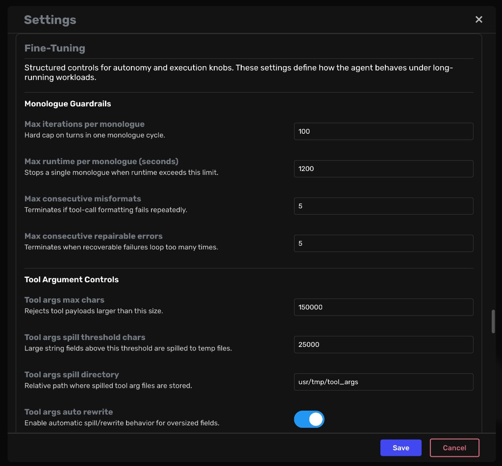

# Autonomy Guardrails Overview

This guide describes the autonomy hardening added on `feature/autonomy`: what changed, why it matters, and how to use the new controls safely.

## What was added

The autonomy work introduces guardrails and budgets across the main failure-prone runtime paths:

- Monologue safety floor (iteration/runtime/error caps)
- Tool argument payload controls (hard size cap + spill-to-file rewrite)
- Code execution reliability controls (timeouts, output bounds, dump path)
- Subordinate delegation limits (depth, calls/turn, runtime)
- Queue backpressure controls (size limits + overflow policy)
- Memory load guardrails (query/limit/response clamps)
- History compression tuning controls (ratios + pass limits)
- Runtime budgets (turn/task/subordinate caps)

All settings are additive and default-safe. Existing behavior remains compatible unless settings are explicitly tightened.

## Where to tune

You can tune autonomy settings in three places:

1. Settings UI: **Agent Settings -> Fine-Tuning**
2. `.env` keys: `A0_SET_<setting_name>`
3. Profile examples: `docs/setup/env-examples/`

## Fine-Tuning panel

A dedicated **Fine-Tuning** panel is available in Settings with sectioned controls and field descriptions. It exposes the main autonomy knobs with typed editors:

- Number controls for caps and limits
- Sliders for ratio knobs
- Toggles for booleans
- Text areas for model/global kwargs

This is the recommended path for interactive tuning and validation.

Fine-Tuning panel preview:

## Important behavior notes

### Tool payload spill is not chunking

`tool_args_spill_threshold_chars` spills large string fields to files and rewrites them for transport, then resolves them before execution. It does not split a single payload into multiple tool calls.

### File-write reliability policy

When `A0_SET_code_exec_prefer_python_file_write=true`:

- terminal heredoc writes are blocked or converted to Python file writes (when command form is safely convertible)
- malformed/unterminated heredocs fail fast with explicit warnings

This prevents common infinite retry loops caused by truncated heredoc tool payloads.

## Operational defaults

A practical starting point is the balanced profile in `docs/setup/env-examples/profile_balanced_production.env`.

From there:

- tighten limits for safety-first deployments
- raise selected limits for large/throughput-heavy workloads
- change one knob family at a time and validate before broader rollout

## Next references

- Full setting-by-setting reference: `autonomy-knobs-reference.md`
- Validation and soak workflow: `autonomy-testing.md`
- Ready-to-apply profile examples: `../setup/env-examples/`
