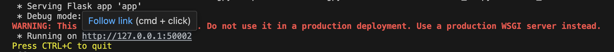
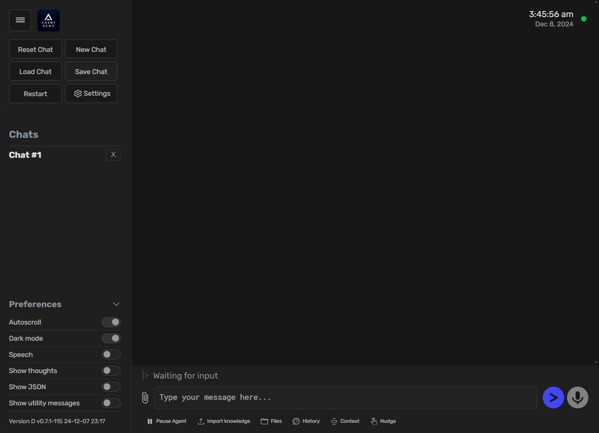
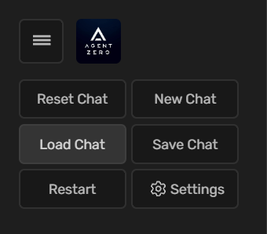
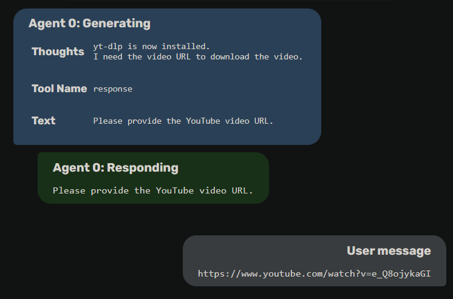

# Quick Start
This guide provides a quick introduction to using Agent Zero. We'll cover launching the web UI, starting a new chat, and running a simple task.

## Launching the Web UI
1. Make sure you have Agent Zero installed and your environment set up correctly (refer to the [Installation guide](installation.md) if needed).
2. Open a terminal in the Agent Zero directory and activate your conda environment (if you're using one).
3. Run one of the following commands:

```bash
# HTTP (default)
python run_ui.py

# HTTPS (dev TLS, runs HTTPS + HTTP in parallel)
python run_ui.py --ssl

# Optionally pick a TLS port
python run_ui.py --ssl 5443
```

Notes:
- HTTP binds to `--host/--port` (or `WEB_UI_HOST`/`WEB_UI_PORT`, default port 5000).
- TLS is enabled only when `--ssl` is set. If you omit the TLS port, it uses `WEB_UI_SSL_PORT` or 5443.
- When `--ssl` is enabled, the dev CA is written under `tmp/` and can be downloaded from `http://127.0.0.1:<HTTP_PORT>/ssl/ca.pem` (loopback only) so you can trust it in your browser/OS.

4. A message similar to this will appear in your terminal, indicating the Web UI is running:



5. Open your web browser and navigate to the URL shown in the terminal (usually `http://127.0.0.1:5000`, or `https://127.0.0.1:5443` when `--ssl` is enabled). You should see the Agent Zero Web UI.



> [!TIP]
> As you can see, the Web UI has four distinct buttons for easy chat management:
> `New Chat`, `Reset Chat`, `Save Chat`, and `Load Chat`.
> Chats can be saved and loaded individually in `json` format and are stored in the
> `/tmp/chats` directory.

    

## Running a Simple Task
Let's ask Agent Zero to download a YouTube video. Here's how:

1.  Type "Download a YouTube video for me" in the chat input field and press Enter or click the send button.

2. Agent Zero will process your request.  You'll see its "thoughts" and the actions it takes displayed in the UI. It will find a default already existing solution, that implies using the `code_execution_tool` to run a simple Python script to perform the task.

3. The agent will then ask you for the URL of the YouTube video you want to download.

## Example Interaction
Here's an example of what you might see in the Web UI at step 3:


## Next Steps
Now that you've run a simple task, you can experiment with more complex requests. Try asking Agent Zero to:

* Perform calculations
* Search the web for information
* Execute shell commands
* Explore web development tasks
* Create or modify files

> [!TIP]
> The [Usage Guide](usage.md) provides more in-depth information on using Agent
> Zero's various features, including prompt engineering, tool usage, and multi-agent
> cooperation.
